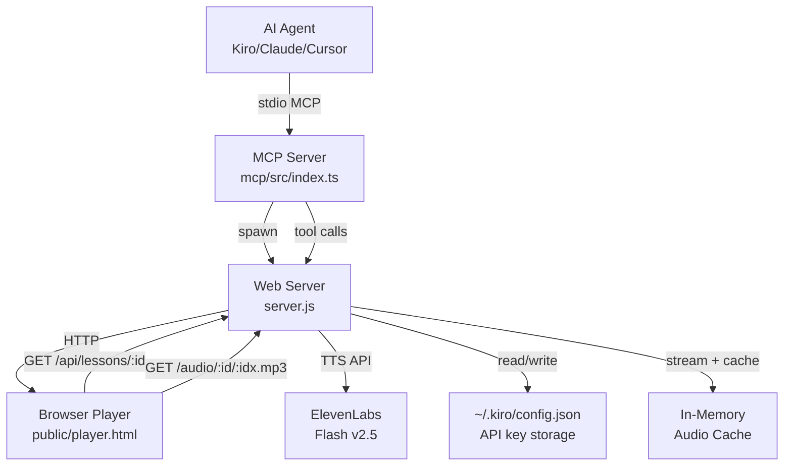

# Design Document: GitExplain

## Overview

GitExplain is a local-first narrated lesson generation system that transforms codebases into interactive slide-video presentations. The system consists of three primary components:

1. **MCP Server** - A Model Context Protocol stdio server that exposes lesson creation tools to AI agents
2. **Web Server** - An Express-based HTTP server that handles lesson storage, audio synthesis, and static asset serving
3. **Player** - A browser-based single-page application that renders lessons with synchronized ElevenLabs narration

The architecture prioritizes **privacy** (source code never leaves the machine), **performance** (streaming audio with aggressive caching), and **developer experience** (one-time API key setup, zero-config installation).

### Key Design Principles

- **Local-first**: All code analysis happens on the developer's machine. Only narration text is sent to ElevenLabs.
- **Zero-persistence**: Lessons are stored in memory only. No database, no disk writes (except API key).
- **Streaming-first**: Audio streams from ElevenLabs to client while simultaneously caching for future plays.
- **Fail-gracefully**: Missing API keys, rate limits, and network errors are handled with clear user guidance.

## Architecture



### Component Interaction Flow

**Lesson Creation Flow:**
1. Agent calls `create_lesson` MCP tool with lesson JSON
2. MCP server forwards request to Web server `/api/lessons` endpoint
3. Web server validates lesson structure and slide schemas
4. Web server assigns unique ID, stores lesson in memory Map
5. Web server returns view URL to MCP server
6. MCP server returns URL to Agent
7. Agent presents URL to user

**Playback Flow:**
1. User opens view URL in browser
2. Player fetches lesson JSON from `/api/lessons/:id`
3. Player renders first slide and requests audio from `/audio/:id/0.mp3`
4. Web server checks audio cache
5. If not cached, Web server streams from ElevenLabs while caching
6. Player plays audio synchronized with slide display
7. On audio end, Player auto-advances to next slide
8. Player prefetches audio for next 2 slides

**API Key Setup Flow:**
1. User opens `/setup` endpoint in browser
2. User pastes ElevenLabs API key into form
3. Web server validates key against ElevenLabs `/v1/user` endpoint
4. Web server writes key to `~/.kiro/config.json` with mode 0o600
5. Browser redirects to lesson view URL

## Components and Interfaces

### 1. MCP Server (`mcp/src/index.ts`)

**Responsibilities:**
- Spawn and manage Web Server child process
- Expose MCP tools and prompts to AI agents
- Forward lesson creation requests to Web Server
- Handle process lifecycle (SIGINT/SIGTERM)

**Exposed Tools:**

```typescript
interface CreateLessonTool {
  name: "create_lesson";
  input: {
    title: string;
    slides: Slide[];
  };
  output: {
    viewUrl: string;
    setupUrl?: string; // only if no API key saved
  };
}
```

**Exposed Prompts:**

```typescript
interface SlideTypesGuidePrompt {
  name: "slide_types_guide";
  description: "Full schema reference for all 20 slide types";
  content: string; // Markdown documentation
}
```

**Server Instructions:**
The MCP server includes comprehensive instructions embedded in the `SERVER_INSTRUCTIONS` constant, covering:
- When to use `create_lesson` (user asks to "explain", "walk through", "teach")
- Slide count guidelines (default 6, range 4-10, max 14)
- Narration style (1-3 sentences, conversational, no filler)
- Schema documentation with common mistakes highlighted
- First-run setup flow (never ask for API key in chat)

**Lifecycle Management:**

```typescript
async function startServer(): Promise<string> {
  // Spawn server.js with PORT=0 for dynamic port allocation
  // Parse stdout for "http://localhost:{port}" to extract base URL
  // Timeout after 8 seconds if server doesn't start
  // Return base URL for API calls
}

function shutdown() {
  // Kill Web Server child process
  // Exit with code 0
}
```

### 2. Web Server (`server.js`)

**Responsibilities:**
- Validate and store lessons in memory
- Serve static assets (player HTML/CSS/JS)
- Synthesize and cache narration audio
- Manage ElevenLabs API key
- Handle graceful degradation for errors

**API Endpoints:**

```typescript
// Lesson Management
POST /api/lessons
  Body: { title: string, slides: Slide[], voiceId?: string }
  Response: { id: string, url: string }
  Errors: 400 with descriptive validation message

GET /api/lessons/:id
  Response: Lesson JSON
  Errors: 404 if not found

// Audio Synthesis
GET /audio/:id/:idx.mp3
  Response: audio/mpeg stream
  Headers: Cache-Control: public, max-age=3600
  Errors: 
    503 { error: "no_key", setupUrl: string }
    429 rate limit from ElevenLabs
    502 ElevenLabs error

// API Key Management
GET /api/key-status
  Response: { hasKey: boolean }

POST /api/key
  Body: { key: string }
  Response: { ok: true }
  Errors: 400 if validation fails

// Setup Page
GET /setup?return=/view/:id
  Response: HTML form for API key entry

// Static Assets
GET /
  Response: index.html (landing page)

GET /view/:id
  Response: player.html

GET /player.css, /player.js
  Response: static assets
```

**Data Structures:**

```typescript
// In-memory storage
const lessons = new Map<string, Lesson>();
const audioCache = new Map<string, Buffer>(); // key: "lessonId:slideIndex"
const inflight = new Map<string, Promise<Buffer>>(); // deduplication

// Lesson structure
interface Lesson {
  title: string;
  summary?: string;
  repo?: {
    name: string;
    branch: string;
    commit: string;
  };
  voiceId?: string;
  slides: Slide[];
}

interface Slide {
  type: SlideType;
  narration: string; // max 500 chars
  data: SlideData; // type-specific
}
```

**Validation Logic:**

The Web Server performs comprehensive validation:

1. **Lesson-level validation:**
   - Verify lesson is non-null object
   - Verify slides is non-empty array (1-20 slides)
   - Warn if slide count exceeds 10 (recommend 6-10)

2. **Slide-level validation:**
   - Verify each slide has type, narration, data
   - Verify type is one of 20 known types
   - Verify narration is string under 500 chars
   - Call type-specific data validator

3. **Type-specific validation:**
   - Check required fields exist
   - Check field types (arrays, objects, strings)
   - Detect common mistakes (e.g., "title" instead of "heading" for flowDiagram)
   - Validate constraints (e.g., flowDiagram max 8 nodes, node labels under 36 chars)
   - Return descriptive error with slide index and exact field name

**Audio Synthesis Flow:**

```typescript
async function handleAudioRequest(lessonId: string, slideIdx: number) {
  const cacheKey = `${lessonId}:${slideIdx}`;
  
  // 1. Check cache
  if (audioCache.has(cacheKey)) {
    return audioCache.get(cacheKey);
  }
  
  // 2. Check inflight (deduplicate concurrent requests)
  if (inflight.has(cacheKey)) {
    return await inflight.get(cacheKey);
  }
  
  // 3. Synthesize from ElevenLabs
  const promise = synthesizeAudio(slide.narration);
  inflight.set(cacheKey, promise);
  
  try {
    const chunks: Buffer[] = [];
    const upstream = await streamFromElevenLabs(text, voiceId, apiKey);
    
    // Stream to client while caching
    for await (const chunk of upstream.body) {
      chunks.push(chunk);
      response.write(chunk);
    }
    
    const buffer = Buffer.concat(chunks);
    audioCache.set(cacheKey, buffer);
    return buffer;
  } finally {
    inflight.delete(cacheKey);
  }
}
```

**ElevenLabs Integration:**

```typescript
async function streamFromElevenLabs(
  text: string,
  voiceId: string,
  apiKey: string
): Promise<Response> {
  const url = `https://api.elevenlabs.io/v1/text-to-speech/${voiceId}/stream?output_format=mp3_44100_64`;
  
  return fetch(url, {
    method: 'POST',
    headers: {
      'xi-api-key': apiKey,
      'Content-Type': 'application/json',
      'Accept': 'audio/mpeg',
    },
    body: JSON.stringify({
      text,
      model_id: 'eleven_flash_v2_5',
      voice_settings: {
        stability: 0.4,
        similarity_boost: 0.75,
        style: 0.0,
        use_speaker_boost: true,
      },
    }),
  });
}
```

### 3. Player (`public/player.js`, `public/player.html`, `public/player.css`)

**Responsibilities:**
- Fetch and render lesson JSON
- Synchronize audio playback with slide display
- Prefetch audio for upcoming slides
- Handle keyboard shortcuts and controls
- Display error states with actionable guidance

**Player State Machine:**

```typescript
interface PlayerState {
  lesson: Lesson | null;
  currentSlide: number;
  audio: HTMLAudioElement;
  captionsOn: boolean;
  warmed: Set<number>; // prefetched slide indices
}

// State transitions
LOADING -> READY (lesson fetched)
READY -> PLAYING (user clicks start)
PLAYING -> PAUSED (user pauses or audio error)
PLAYING -> PLAYING (auto-advance on audio end)
PAUSED -> PLAYING (user resumes)
```

**Rendering Architecture:**

The Player uses a renderer registry pattern:

```typescript
const RENDERERS: Record<SlideType, (data: any, slide: Slide) => string> = {
  title: (d) => `<section class="s-title">...</section>`,
  bullets: (d) => `<section class="s-bullets">...</section>`,
  code: (d) => `<section class="s-code">...</section>`,
  // ... 17 more renderers
  _unknown: (d, slide) => `<div class="slide-err">Unknown type: ${slide.type}</div>`,
};

function renderSlide(index: number) {
  const slide = lesson.slides[index];
  const renderer = RENDERERS[slide.type] || RENDERERS._unknown;
  stage.innerHTML = renderer(slide.data, slide);
  
  // Apply syntax highlighting
  stage.querySelectorAll('pre code').forEach(hljs.highlightElement);
  
  // Update UI
  counter.textContent = `${index + 1} / ${lesson.slides.length}`;
  progress.style.width = `${((index + 1) / lesson.slides.length) * 100}%`;
  caption.textContent = slide.narration;
  
  // Load and play audio
  audio.src = `/audio/${lessonId}/${index}.mp3`;
  audio.play();
  
  // Prefetch next slides
  warmAudio(index + 1);
  warmAudio(index + 2);
}
```

**Error Handling:**

The Player detects and displays specific error conditions:

```typescript
audio.addEventListener('error', async () => {
  const response = await fetch(audio.src);
  
  if (response.status === 503) {
    const body = await response.json();
    if (body.error === 'no_key') {
      showError(`No narration yet. <a href="${body.setupUrl}">Set up your ElevenLabs key</a>`);
      return;
    }
  }
  
  if (response.status === 401 || response.status === 403) {
    showError(`The saved ElevenLabs key is invalid. <a href="/setup">Replace it here</a>.`);
    return;
  }
  
  if (response.status === 429) {
    showError(`Rate limit reached. Try again in a moment.`);
    return;
  }
  
  showError(`Audio failed (HTTP ${response.status}). Check the server log.`);
});
```

**Keyboard Shortcuts:**

- `Space`: Play/pause
- `ArrowLeft`: Previous slide
- `ArrowRight`: Next slide
- `R`: Restart from beginning
- `C`: Toggle captions
- `Esc`: Pause

### 4. Lesson Generator (Agent-side, not implemented in codebase)

**Responsibilities:**
- Analyze repository structure
- Extract key components and flows
- Generate lesson JSON with appropriate slide types
- Balance slide count with content depth

**Conceptual Interface:**

```typescript
interface LessonGenerator {
  generateFullRepoLesson(repoPath: string): Lesson;
  generateFocusedLesson(repoPath: string, focus: string, paths: string[]): Lesson;
}

// Agent workflow:
// 1. Scan repository (read file tree, identify entry points)
// 2. Analyze architecture (detect frameworks, patterns, dependencies)
// 3. Select slide types (title, fileTree, architecture, code, summary)
// 4. Write narration (conversational, insight-focused)
// 5. Call create_lesson MCP tool
```

### 5. Repository Scanner (Agent-side, not implemented in codebase)

**Responsibilities:**
- Traverse directory tree
- Respect .gitignore rules
- Extract git metadata
- Read file contents
- Identify file types

**Conceptual Interface:**

```typescript
interface RepoScanner {
  scanDirectory(path: string): FileTree;
  readFile(path: string): string;
  getGitMetadata(): RepoMetadata;
  identifyFileType(path: string): string;
}

interface FileTree {
  entries: Array<{
    name: string;
    depth: number;
    kind: 'dir' | 'file';
    path: string;
  }>;
}

interface RepoMetadata {
  name: string;
  branch: string;
  commit: string;
  remote?: string;
}
```

## Data Models

### Lesson Schema

```typescript
interface Lesson {
  title: string;
  summary?: string;
  repo?: {
    name: string;
    branch: string;
    commit: string;
  };
  voiceId?: string; // Override default voice
  slides: Slide[];
}
```

### Slide Schema

```typescript
type SlideType =
  | 'title' | 'bullets' | 'code' | 'codeCompare' | 'fileTree'
  | 'flowDiagram' | 'sequenceDiagram' | 'architecture' | 'callout'
  | 'definition' | 'twoColumn' | 'stats' | 'terminal' | 'steps'
  | 'timeline' | 'warning' | 'quiz' | 'summary' | 'image' | 'comparison';

interface Slide {
  type: SlideType;
  narration: string; // 1-500 chars
  data: SlideData;
}

// Type-specific data schemas:

interface TitleData {
  title: string;
  subtitle?: string;
}

interface BulletsData {
  heading?: string;
  style?: 'dot' | 'check' | 'number';
  items: string[];
}

interface CodeData {
  heading?: string;
  caption?: string;
  language: string;
  code: string;
  highlight?: number[]; // 1-indexed line numbers
}

interface CodeCompareData {
  leftLabel?: string;
  leftKind?: 'bad' | 'good';
  leftLanguage?: string;
  leftCode: string;
  rightLabel?: string;
  rightKind?: 'bad' | 'good';
  rightLanguage?: string;
  rightCode: string;
}

interface FileTreeData {
  heading?: string;
  entries: Array<{
    name: string;
    depth?: number; // 0 = root, 1 = one indent, etc.
    kind?: 'dir' | 'file';
    highlight?: boolean;
    dim?: boolean;
    note?: string;
  }>;
}

interface FlowDiagramData {
  heading?: string; // NOT "title"
  direction?: 'LR' | 'TB';
  nodes: Array<{
    id: string;
    label: string; // max 36 chars
  }>; // max 8 nodes
  edges: Array<{
    from: string;
    to: string;
    label?: string;
  }>;
}

interface SequenceDiagramData {
  heading?: string;
  actors: string[];
  messages: Array<{
    from: string;
    to: string;
    text: string;
  }>;
}

interface ArchitectureData {
  heading?: string; // NOT "title"
  layers: Array<{
    name: string;
    nodes: string[]; // NOT "items"
  }>;
}

interface CalloutData {
  kind?: 'info' | 'tip' | 'warning' | 'success';
  title: string;
  body: string;
}

interface DefinitionData {
  term: string;
  definition: string;
  also?: string;
}

interface TwoColumnData {
  leftHeading: string;
  leftBody: string;
  rightHeading: string;
  rightBody: string;
}

interface StatsData {
  heading?: string;
  items: Array<{
    value: string;
    label: string;
  }>;
}

interface TerminalData {
  prompt?: string;
  command: string;
  output?: string[];
}

interface StepsData {
  heading?: string; // NOT "title"
  steps: Array<{
    title: string;
    detail?: string; // NOT "description"
  }>;
}

interface TimelineData {
  heading?: string;
  events: Array<{
    time: string;
    event: string;
  }>;
}

interface WarningData {
  title?: string;
  pitfalls: string[];
}

interface QuizData {
  question: string;
  choices: string[];
  answerIndex: number; // 0-indexed
  explanation?: string;
}

interface SummaryData {
  heading?: string; // NOT "title"
  points: string[]; // NOT "bullets"
}

interface ImageData {
  url: string;
  alt?: string;
  caption?: string;
}

interface ComparisonData {
  heading?: string; // NOT "title"
  leftLabel: string; // NOT "leftTitle"
  rightLabel: string; // NOT "rightTitle"
  rows: Array<{
    label: string;
    left: string;
    right: string;
  }>; // 3-6 rows recommended
}

type SlideData =
  | TitleData | BulletsData | CodeData | CodeCompareData | FileTreeData
  | FlowDiagramData | SequenceDiagramData | ArchitectureData | CalloutData
  | DefinitionData | TwoColumnData | StatsData | TerminalData | StepsData
  | TimelineData | WarningData | QuizData | SummaryData | ImageData
  | ComparisonData;
```

### Configuration Schema

```typescript
// ~/.kiro/config.json
interface KiroConfig {
  elevenLabsKey?: string;
}
```

### Environment Variables

```typescript
interface EnvironmentConfig {
  PORT?: string; // Default: "4178", "0" for dynamic
  ELEVENLABS_API_KEY?: string; // Fallback if config.json missing
  ELEVENLABS_VOICE_ID?: string; // Default: "21m00Tcm4TlvDq8ikWAM" (Rachel)
  ELEVENLABS_OUTPUT_FORMAT?: string; // Default: "mp3_44100_64"
}
```


## Narration Caching Strategy

### Cache Architecture

The Web Server implements a three-tier caching strategy:

1. **Memory Cache** (`audioCache: Map<string, Buffer>`)
   - Stores synthesized audio buffers indefinitely (until server restart)
   - Key format: `"${lessonId}:${slideIndex}"`
   - No size limit (assumes reasonable lesson counts)
   - No eviction policy (lessons are ephemeral, server restarts clear cache)

2. **Inflight Deduplication** (`inflight: Map<string, Promise<Buffer>>`)
   - Prevents duplicate concurrent requests to ElevenLabs
   - If 10 clients request same audio simultaneously, only 1 ElevenLabs call is made
   - All clients receive the same streamed response
   - Cleared immediately after synthesis completes

3. **HTTP Cache Headers**
   - `Cache-Control: public, max-age=3600`
   - `Content-Type: audio/mpeg`
   - `Content-Length: ${buffer.length}`
   - Allows browser and proxy caching for 1 hour

### Cache Hit Flow

```
Client requests /audio/abc123/0.mp3
  ↓
Check audioCache.has("abc123:0")
  ↓ YES
Return cached buffer with headers
  ↓
Client plays audio instantly
```

### Cache Miss Flow

```
Client requests /audio/abc123/0.mp3
  ↓
Check audioCache.has("abc123:0")
  ↓ NO
Check inflight.has("abc123:0")
  ↓ NO
Create synthesis promise
  ↓
Store promise in inflight map
  ↓
Call ElevenLabs streaming endpoint
  ↓
For each chunk:
  - Write to client response
  - Append to chunks array
  ↓
Concatenate chunks into buffer
  ↓
Store buffer in audioCache
  ↓
Delete from inflight map
  ↓
Client plays audio as it streams
```

### Concurrent Request Deduplication

```
Client A requests /audio/abc123/0.mp3 (t=0ms)
Client B requests /audio/abc123/0.mp3 (t=50ms)
Client C requests /audio/abc123/0.mp3 (t=100ms)
  ↓
Client A: Cache miss, start synthesis, store promise in inflight
  ↓
Client B: Cache miss, inflight hit, await same promise
  ↓
Client C: Cache miss, inflight hit, await same promise
  ↓
ElevenLabs returns audio stream
  ↓
All three clients receive the same buffer
  ↓
Buffer stored in audioCache
  ↓
Client D requests /audio/abc123/0.mp3 (t=2000ms)
  ↓
Client D: Cache hit, instant response
```

### Cache Invalidation

**No explicit invalidation is needed** because:
- Lessons are immutable once created (no updates)
- Lesson IDs are unique random hex strings
- Server restart clears all state (lessons + cache)
- Narration text is deterministic (same text = same audio)

### Memory Considerations

**Typical memory usage:**
- Average narration: 2-3 sentences = ~150 chars
- ElevenLabs mp3_44100_64 format: ~8KB per second of audio
- Average narration duration: 10-15 seconds
- Average audio size: 80-120KB per slide
- 10-slide lesson: ~1MB cached audio
- 100 lessons in memory: ~100MB

**No memory limits enforced** because:
- GitExplain is a development tool, not a production service
- Lessons are ephemeral (created for immediate viewing)
- Server restarts are frequent during development
- Memory pressure is unlikely in typical usage

## Security and Privacy Model

### Threat Model

**In Scope:**
- Protecting source code from leaving the developer's machine
- Protecting ElevenLabs API key from unauthorized access
- Preventing injection attacks via lesson JSON

**Out of Scope:**
- Multi-user authentication (single-user local tool)
- Network security (localhost-only binding)
- Persistent storage security (no database)

### Data Flow Classification

| Data Type | Stays Local | Sent to ElevenLabs | Stored on Disk |
|-----------|-------------|-------------------|----------------|
| Source code | ✅ | ❌ | ❌ |
| Lesson JSON | ✅ | ❌ | ❌ |
| Narration text | ✅ | ✅ | ❌ |
| API key | ✅ | ✅ (in headers) | ✅ (config.json) |
| Audio buffers | ✅ | ❌ | ❌ |

### Privacy Guarantees

1. **Source Code Never Leaves Machine**
   - Repository scanning happens agent-side (not in GitExplain codebase)
   - Lesson JSON contains code snippets chosen by agent
   - Code snippets are rendered in browser, never sent to ElevenLabs
   - Only narration text (human-readable explanations) is sent to ElevenLabs

2. **API Key Protection**
   - Stored at `~/.kiro/config.json` with file mode `0o600` (owner read/write only)
   - Never logged to stdout/stderr
   - Never included in error messages
   - Transmitted only in HTTPS headers to ElevenLabs
   - Not exposed via any HTTP endpoint (write-only via POST /api/key)

3. **Localhost-Only Binding**
   - Web Server binds to `localhost` only (no `0.0.0.0`)
   - Not accessible from network
   - No CORS headers (same-origin only)
   - No authentication needed (single-user local tool)

4. **No Persistent Storage**
   - Lessons stored in memory only
   - Audio cache stored in memory only
   - Server restart clears all data
   - No logs written to disk

### Injection Attack Prevention

**JSON Injection:**
- All lesson JSON is validated before storage
- Slide data is validated against type-specific schemas
- No `eval()` or dynamic code execution
- HTML rendering uses explicit escaping:

```typescript
const esc = (s) => String(s).replace(/[&<>"']/g, (c) => ({
  '&': '&amp;', '<': '&lt;', '>': '&gt;', '"': '&quot;', "'": '&#39;',
}[c]));
```

**Command Injection:**
- No shell commands executed with user input
- MCP server spawns Web Server with fixed arguments
- No file system writes except API key (validated path)

**Path Traversal:**
- Lesson IDs are generated server-side (random hex)
- No user-provided file paths in HTTP endpoints
- Static assets served from fixed `public/` directory

### ElevenLabs API Security

**Request Security:**
- HTTPS only (enforced by ElevenLabs)
- API key in `xi-api-key` header (not in URL)
- No user data in URL query parameters
- Request body contains only narration text (no code)

**Response Handling:**
- Audio stream validated as `audio/mpeg` content type
- Error responses logged but not exposed to client (except status codes)
- Rate limit errors (429) passed through to client for user guidance

### Configuration File Security

**~/.kiro/config.json:**
```json
{
  "elevenLabsKey": "sk_..."
}
```

**Security measures:**
- File created with mode `0o600` (owner read/write only)
- Directory `~/.kiro` created with `recursive: true`
- No group or world permissions
- Validated before write (ElevenLabs API check)
- Read-only from environment variable fallback

## Error Handling

### Error Categories

1. **Validation Errors** (HTTP 400)
   - Malformed lesson JSON
   - Invalid slide types
   - Missing required fields
   - Schema violations

2. **Not Found Errors** (HTTP 404)
   - Lesson ID doesn't exist
   - Slide index out of range

3. **Authentication Errors** (HTTP 401/403)
   - Invalid ElevenLabs API key
   - Expired API key

4. **Rate Limit Errors** (HTTP 429)
   - ElevenLabs quota exceeded
   - Too many requests

5. **Service Unavailable Errors** (HTTP 503)
   - No API key configured
   - ElevenLabs service down

6. **Server Errors** (HTTP 502)
   - ElevenLabs API error
   - Network failure

### Error Response Format

**Validation Error Example:**
```json
{
  "error": "slide 3 (flowDiagram): use \"heading\" not \"title\" — the renderer only reads \"heading\"."
}
```

**No API Key Error Example:**
```json
{
  "error": "no_key",
  "setupUrl": "/setup?return=/view/abc123"
}
```

**ElevenLabs Error Example:**
```json
{
  "error": "ElevenLabs 401: Invalid API key"
}
```

### Error Handling Strategies

#### 1. Validation Errors

**Server-side:**
```typescript
function validateLesson(lesson: any): string | null {
  // Return descriptive error string or null if valid
  // Include slide index and exact field name in error
  // Suggest corrections for common mistakes
}

app.post('/api/lessons', (req, res) => {
  const err = validateLesson(req.body);
  if (err) return res.status(400).json({ error: err });
  // ... proceed with storage
});
```

**Agent-side:**
- Parse error message to identify exact issue
- Fix the specific field mentioned in error
- Retry create_lesson with corrected data
- Do not give up or ask user (error is self-explanatory)

#### 2. Missing API Key

**Server-side:**
```typescript
app.get('/audio/:id/:idx.mp3', async (req, res) => {
  const apiKey = readKey();
  if (!apiKey) {
    return res.status(503).json({
      error: 'no_key',
      setupUrl: `/setup?return=/view/${req.params.id}`,
    });
  }
  // ... proceed with synthesis
});
```

**Player-side:**
```typescript
audio.addEventListener('error', async () => {
  const response = await fetch(audio.src);
  if (response.status === 503) {
    const body = await response.json();
    if (body.error === 'no_key') {
      showError(`No narration yet. <a href="${body.setupUrl}">Set up your ElevenLabs key</a>`);
    }
  }
});
```

**Agent-side:**
- If create_lesson returns setupUrl, include it in response to user
- Tell user to open URL in browser (never ask for key in chat)
- Explain that key is saved once and works for all future lessons

#### 3. Invalid API Key

**Server-side:**
```typescript
app.post('/api/key', async (req, res) => {
  const key = req.body.key.trim();
  const validation = await fetch('https://api.elevenlabs.io/v1/user', {
    headers: { 'xi-api-key': key },
  });
  if (!validation.ok) {
    return res.status(400).json({
      error: `ElevenLabs rejected this key (${validation.status})`,
    });
  }
  writeKey(key);
  res.json({ ok: true });
});
```

**Player-side:**
```typescript
if (/invalid[_ ]?api[_ ]?key/i.test(errorText)) {
  showError(`The saved ElevenLabs key is invalid. <a href="/setup">Replace it here</a>.`);
}
```

#### 4. Rate Limiting

**Server-side:**
```typescript
if (upstream.status === 429) {
  return res.status(429).end('ElevenLabs rate limit exceeded');
}
```

**Player-side:**
```typescript
if (response.status === 429) {
  showError(`Rate limit reached. Try again in a moment.`);
}
```

**Degraded mode:**
- Player allows navigation between slides even without audio
- User can read narration text via captions (toggle with C key)
- Lesson remains functional as a slide deck

#### 5. Network Failures

**Server-side:**
```typescript
try {
  const upstream = await streamFromElevenLabs(text, voiceId, apiKey);
  // ... stream audio
} catch (e) {
  console.error('[audio]', e.message);
  if (!res.headersSent) {
    res.status(502).end(String(e.message));
  }
}
```

**Player-side:**
```typescript
audio.addEventListener('error', async () => {
  // ... try to fetch error details
  showError(`Audio failed. Check the server log.`);
});
```

**Degraded mode:**
- Same as rate limiting: slides work, audio fails gracefully
- User can retry by refreshing or navigating to another slide

### Graceful Degradation Matrix

| Failure Mode | Lesson Creation | Lesson Viewing | Audio Playback | Navigation |
|--------------|----------------|----------------|----------------|------------|
| No API key | ✅ (returns setupUrl) | ✅ | ❌ (shows setup link) | ✅ |
| Invalid API key | ✅ | ✅ | ❌ (shows replace link) | ✅ |
| Rate limit | ✅ | ✅ | ❌ (shows retry message) | ✅ |
| Network failure | ✅ | ✅ | ❌ (shows error) | ✅ |
| Malformed lesson | ❌ (validation error) | N/A | N/A | N/A |
| Server crash | ❌ | ❌ | ❌ | ❌ |

### Logging Strategy

**Server logs (stderr):**
```
[kiro-server] kiro lesson player running on http://localhost:4178
[kiro-server] voice=21m00Tcm4TlvDq8ikWAM  model=eleven_flash_v2_5  format=mp3_44100_64
[kiro-mcp] kiro server ready at http://localhost:4178
[kiro-mcp] MCP stdio transport connected
[audio] ElevenLabs 429: Rate limit exceeded
[unhandledRejection] Failed to fetch audio
```

**What is logged:**
- Server startup (port, voice, model, format)
- MCP connection status
- Audio synthesis errors (with [audio] prefix)
- Unhandled promise rejections
- Uncaught exceptions

**What is NOT logged:**
- API keys
- Lesson content
- Narration text
- User actions
- HTTP request details (no access logs)

### Process Lifecycle Error Handling

**Startup failures:**
```typescript
async function startServer(): Promise<string> {
  return new Promise((resolve, reject) => {
    const proc = spawn(process.execPath, [SERVER_JS], { ... });
    
    setTimeout(() => {
      reject(new Error('kiro server did not start within 8s'));
    }, 8000);
    
    proc.on('exit', (code) => {
      reject(new Error(`kiro server exited with code ${code} before ready`));
    });
  });
}
```

**Shutdown handling:**
```typescript
function shutdown() {
  if (serverProc && !serverProc.killed) serverProc.kill();
  process.exit(0);
}

process.on('SIGINT', shutdown);
process.on('SIGTERM', shutdown);
```

**Unhandled errors:**
```typescript
process.on('unhandledRejection', (e) => {
  console.error('[unhandledRejection]', e?.message || e);
});

process.on('uncaughtException', (e) => {
  console.error('[uncaughtException]', e?.message || e);
});
```


## Correctness Properties

*A property is a characteristic or behavior that should hold true across all valid executions of a system—essentially, a formal statement about what the system should do. Properties serve as the bridge between human-readable specifications and machine-verifiable correctness guarantees.*

### Property Reflection

After analyzing all acceptance criteria, I identified the following testable properties. Through reflection, I've eliminated redundancy:

**Redundancy eliminated:**
- Properties 15.4 and 15.5 (field preservation, order preservation) are subsumed by 15.3 (round-trip property)
- Property 18.1-18.5 (metadata preservation) is covered by the round-trip property
- Multiple validation properties can be combined into comprehensive validation properties

**Properties retained:**
- Round-trip property (15.3, 15.6) - fundamental correctness guarantee
- Validation properties (3.2, 10.2, 10.3, 11.1-11.5) - comprehensive input validation
- ID uniqueness (3.3) - critical for lesson storage
- URL format (3.4) - API contract
- Caching behavior (6.1, 6.2) - performance guarantee
- Error message quality (10.4, 11.5) - developer experience

### Property 1: Lesson Round-Trip Preservation

*For any* valid lesson object, serializing with JSON.stringify then parsing with JSON.parse SHALL produce an equivalent object with all fields, slide order, and Unicode characters preserved.

**Validates: Requirements 15.3, 15.4, 15.5, 15.6, 18.1-18.5**

**Rationale:** This is the fundamental correctness property for lesson storage. If round-trip fails, lessons will be corrupted in memory, leading to incorrect playback. This property ensures that:
- All lesson metadata (title, summary, repo, voiceId) is preserved
- All slides are preserved in order
- All slide data fields are preserved
- Unicode characters in narration are not corrupted
- Optional fields (summary, repo, voiceId) are preserved when present

**Test Strategy:**
- Generate random valid lessons with varying structures:
  - Different slide counts (1-20)
  - Different slide types (all 20 types)
  - Optional fields present/absent
  - Unicode characters in narration (emoji, CJK, RTL scripts)
  - Nested data structures (fileTree entries, flowDiagram nodes/edges)
- For each lesson: `const result = JSON.parse(JSON.stringify(lesson))`
- Assert deep equality: `expect(result).toEqual(lesson)`
- Run 100+ iterations to cover edge cases

### Property 2: Valid Lessons Pass Validation

*For any* lesson object that conforms to the lesson schema (has title string, slides array with 1-20 valid slides), the validation function SHALL return null (no error).

**Validates: Requirements 3.2, 11.1, 11.2, 11.3**

**Rationale:** The validation function must accept all valid lessons. False negatives (rejecting valid lessons) would prevent legitimate use cases. This property ensures the validator is not overly strict.

**Test Strategy:**
- Generate random valid lessons:
  - Random slide counts (1-20)
  - Random slide types (all 20 types)
  - Random valid data for each type
  - Optional fields randomly present/absent
- For each lesson: `const error = validateLesson(lesson)`
- Assert: `expect(error).toBeNull()`
- Run 100+ iterations

### Property 3: Invalid Lessons Fail Validation

*For any* lesson object that violates the lesson schema (missing title, missing slides, slides not an array, slide count > 20, slide missing required fields, narration > 500 chars), the validation function SHALL return a non-null error string.

**Validates: Requirements 11.1, 11.2, 11.3, 11.4, 11.5**

**Rationale:** The validation function must reject all invalid lessons. False positives (accepting invalid lessons) would lead to runtime errors during playback. This property ensures the validator catches all schema violations.

**Test Strategy:**
- Generate random invalid lessons:
  - Missing title
  - Missing slides array
  - Slides not an array (null, string, number, object)
  - Empty slides array
  - Slide count > 20
  - Slides missing type/narration/data
  - Narration > 500 characters
  - Invalid slide types
- For each lesson: `const error = validateLesson(lesson)`
- Assert: `expect(error).not.toBeNull()`
- Assert: `expect(typeof error).toBe('string')`
- Run 100+ iterations

### Property 4: Unknown Slide Types Are Rejected

*For any* slide with a type value that is not one of the 20 known slide types, the validation function SHALL return an error string containing "unknown type".

**Validates: Requirements 10.2**

**Rationale:** The system must reject slides with unknown types to prevent runtime errors when the renderer tries to render them. The error message must clearly indicate the problem.

**Test Strategy:**
- Generate random invalid slide types:
  - Random strings not in SLIDE_TYPES set
  - Empty string
  - Null/undefined
  - Numbers, booleans, objects
- Create lessons with one invalid slide
- For each lesson: `const error = validateLesson(lesson)`
- Assert: `expect(error).toContain('unknown type')`
- Run 100+ iterations

### Property 5: Type-Specific Validation Enforces Schema

*For any* slide of a given type, if the slide's data object is missing required fields or has incorrect field types for that type, the validation function SHALL return an error string identifying the slide index and field name.

**Validates: Requirements 10.3, 10.4**

**Rationale:** Each slide type has a specific schema. The validator must enforce these schemas to prevent runtime errors during rendering. Error messages must be specific enough for agents to fix the issue.

**Test Strategy:**
- For each of 20 slide types:
  - Generate random invalid data (missing required fields, wrong types)
  - Create lesson with one invalid slide
  - Verify validation returns error with slide index and field name
- Examples:
  - title slide missing "title" field
  - bullets slide with "items" as string instead of array
  - flowDiagram with "title" instead of "heading"
  - architecture with "items" instead of "nodes"
  - steps with "description" instead of "detail"
- Run 100+ iterations (5+ per slide type)

### Property 6: Validation Errors Include Slide Index

*For any* lesson with an invalid slide, the validation error string SHALL contain the slide index (e.g., "slide 3").

**Validates: Requirements 10.4, 11.5**

**Rationale:** When a lesson has multiple slides, the error message must identify which slide is invalid so the agent can fix it. Without the index, the agent would have to guess.

**Test Strategy:**
- Generate lessons with 5-10 slides
- Make one random slide invalid (random index)
- Verify error contains "slide {index}"
- Run 100+ iterations

### Property 7: Validation Errors Include Field Name

*For any* slide with invalid data, the validation error string SHALL contain the exact field name that is incorrect.

**Validates: Requirements 10.4, 11.5**

**Rationale:** The error message must identify the specific field so the agent can fix it. Generic errors like "invalid data" are not actionable.

**Test Strategy:**
- For each slide type:
  - Generate slide with one invalid field
  - Verify error contains the field name
- Examples:
  - Missing "title" → error contains "title"
  - Missing "items" → error contains "items"
  - Wrong "heading" → error contains "heading"
- Run 100+ iterations

### Property 8: Lesson ID Uniqueness

*For any* sequence of lesson creation requests, all assigned lesson IDs SHALL be unique (no collisions).

**Validates: Requirements 3.3**

**Rationale:** Lesson IDs are used as keys in the lessons Map and in URLs. Collisions would cause one lesson to overwrite another, leading to incorrect playback.

**Test Strategy:**
- Create 1000 lessons in sequence
- Collect all IDs in a Set
- Assert: `expect(ids.size).toBe(1000)`
- Run multiple times to test randomness

### Property 9: View URL Format

*For any* successfully created lesson, the returned view URL SHALL match the format `http://localhost:{port}/view/{id}` where {port} is a valid port number and {id} is a 12-character hex string.

**Validates: Requirements 3.4**

**Rationale:** The view URL is the API contract between the server and the agent. Incorrect URLs would prevent users from viewing lessons.

**Test Strategy:**
- Create random lessons
- For each response: `const { viewUrl } = response`
- Assert: `expect(viewUrl).toMatch(/^http:\/\/localhost:\d+\/view\/[0-9a-f]{12}$/)`
- Run 100+ iterations

### Property 10: Audio Cache Hit Performance

*For any* audio request that has been requested before, the second request SHALL be served from cache (no ElevenLabs API call) and SHALL return the same audio buffer.

**Validates: Requirements 6.1, 6.2**

**Rationale:** Caching is critical for performance and cost. Without caching, every playback would make expensive API calls. This property ensures the cache works correctly.

**Test Strategy:**
- Create lesson with 5 slides
- Request audio for slide 0 (cache miss, slow)
- Request audio for slide 0 again (cache hit, fast)
- Assert: second request is faster (< 10ms)
- Assert: both responses have identical content
- Run 100+ iterations with different lessons

### Property 11: Cached Audio Has Correct Headers

*For any* cached audio response, the HTTP headers SHALL include `Content-Type: audio/mpeg` and `Cache-Control: public, max-age=3600`.

**Validates: Requirements 6.2**

**Rationale:** Correct headers enable browser caching and proper audio playback. Missing or incorrect headers would cause playback failures or unnecessary re-requests.

**Test Strategy:**
- Create lesson and request audio twice (to ensure cache hit)
- On second request, verify headers:
  - `Content-Type: audio/mpeg`
  - `Cache-Control: public, max-age=3600`
- Run 100+ iterations

### Property 12: Narration Length Validation

*For any* slide with narration text exceeding 500 characters, the validation function SHALL return an error string containing "narration" and "500".

**Validates: Requirements 11.4**

**Rationale:** Long narrations kill pacing and increase synthesis cost. The validator must enforce the 500-character limit.

**Test Strategy:**
- Generate random narrations of various lengths (0-1000 chars)
- For narrations > 500 chars:
  - Create lesson with that narration
  - Verify validation error contains "narration" and "500"
- For narrations ≤ 500 chars:
  - Verify validation passes
- Run 100+ iterations

### Property 13: Slide Count Validation

*For any* lesson with 0 slides or more than 20 slides, the validation function SHALL return an error string.

**Validates: Requirements 11.2**

**Rationale:** The system must enforce slide count limits to prevent empty lessons (0 slides) and excessively long lessons (> 20 slides).

**Test Strategy:**
- Generate lessons with slide counts: 0, 1, 10, 20, 21, 50, 100
- For counts 0 and > 20: verify validation fails
- For counts 1-20: verify validation passes
- Run 100+ iterations

### Property 14: Required Slide Fields Validation

*For any* slide missing the type, narration, or data field, the validation function SHALL return an error string identifying the missing field.

**Validates: Requirements 11.3**

**Rationale:** All three fields are required for rendering. Missing fields would cause runtime errors.

**Test Strategy:**
- Generate slides missing each field:
  - Missing type
  - Missing narration
  - Missing data
  - Missing multiple fields
- For each: verify validation error identifies the missing field
- Run 100+ iterations

### Property 15: Common Field Name Mistakes Are Detected

*For any* slide with common field name mistakes (e.g., "title" instead of "heading" for flowDiagram, "items" instead of "nodes" for architecture, "description" instead of "detail" for steps), the validation function SHALL return an error string suggesting the correct field name.

**Validates: Requirements 11.6, 11.7**

**Rationale:** Agents frequently make these mistakes. Helpful error messages reduce trial-and-error and improve developer experience.

**Test Strategy:**
- For each known mistake pattern:
  - flowDiagram with "title" instead of "heading"
  - architecture with "items" instead of "nodes"
  - steps with "description" instead of "detail"
  - summary with "bullets" instead of "points"
  - comparison with "leftTitle" instead of "leftLabel"
- Verify error suggests correct field name
- Run 100+ iterations (20+ per mistake type)


## Testing Strategy

### Overview

GitExplain requires a dual testing approach:

1. **Property-Based Tests**: Verify universal properties across all valid inputs (lesson validation, round-trip, caching)
2. **Unit Tests**: Verify specific examples, edge cases, and error conditions (API endpoints, error messages, UI interactions)
3. **Integration Tests**: Verify external service integration (ElevenLabs API, MCP protocol, process lifecycle)

### Property-Based Testing

**Library Selection:**
- **JavaScript/TypeScript**: Use `fast-check` (mature, well-documented, TypeScript support)
- **Why not implement from scratch**: PBT libraries provide sophisticated shrinking algorithms, generator combinators, and edge case detection that would take months to implement correctly

**Configuration:**
- Minimum 100 iterations per property test (due to randomization)
- Each property test MUST reference its design document property in a comment
- Tag format: `// Feature: git-explain, Property {number}: {property_text}`

**Example Property Test:**

```typescript
import fc from 'fast-check';
import { validateLesson } from './server.js';

// Feature: git-explain, Property 2: Valid Lessons Pass Validation
test('valid lessons pass validation', () => {
  fc.assert(
    fc.property(
      validLessonGenerator(), // custom generator
      (lesson) => {
        const error = validateLesson(lesson);
        expect(error).toBeNull();
      }
    ),
    { numRuns: 100 }
  );
});

// Custom generator for valid lessons
function validLessonGenerator() {
  return fc.record({
    title: fc.string({ minLength: 1, maxLength: 100 }),
    slides: fc.array(validSlideGenerator(), { minLength: 1, maxLength: 20 }),
    summary: fc.option(fc.string({ maxLength: 200 })),
    voiceId: fc.option(fc.string({ minLength: 10, maxLength: 50 })),
  });
}

function validSlideGenerator() {
  return fc.oneof(
    titleSlideGenerator(),
    bulletsSlideGenerator(),
    codeSlideGenerator(),
    // ... 17 more slide type generators
  );
}

function titleSlideGenerator() {
  return fc.record({
    type: fc.constant('title'),
    narration: fc.string({ minLength: 1, maxLength: 500 }),
    data: fc.record({
      title: fc.string({ minLength: 1, maxLength: 100 }),
      subtitle: fc.option(fc.string({ maxLength: 100 })),
    }),
  });
}
```

**Property Test Coverage:**

| Property | Test File | Generator Complexity |
|----------|-----------|---------------------|
| 1. Round-trip | `test/lesson-roundtrip.test.js` | High (all slide types) |
| 2. Valid lessons pass | `test/validation-valid.test.js` | High (all slide types) |
| 3. Invalid lessons fail | `test/validation-invalid.test.js` | Medium (schema violations) |
| 4. Unknown types rejected | `test/validation-types.test.js` | Low (random strings) |
| 5. Type-specific validation | `test/validation-schemas.test.js` | High (20 slide types) |
| 6. Error includes index | `test/validation-errors.test.js` | Low (invalid slides) |
| 7. Error includes field | `test/validation-errors.test.js` | Medium (field violations) |
| 8. ID uniqueness | `test/lesson-ids.test.js` | Low (sequence generation) |
| 9. URL format | `test/lesson-urls.test.js` | Low (regex matching) |
| 10. Cache hit performance | `test/audio-cache.test.js` | Medium (timing assertions) |
| 11. Cache headers | `test/audio-cache.test.js` | Low (header assertions) |
| 12. Narration length | `test/validation-narration.test.js` | Low (string length) |
| 13. Slide count | `test/validation-slides.test.js` | Low (array length) |
| 14. Required fields | `test/validation-fields.test.js` | Medium (field omission) |
| 15. Field name mistakes | `test/validation-mistakes.test.js` | Medium (known patterns) |

### Unit Testing

**Unit tests focus on:**
- Specific examples that demonstrate correct behavior
- Edge cases not easily covered by property tests
- Error message formatting
- HTTP endpoint contracts
- UI interactions

**Example Unit Tests:**

```typescript
// Specific example: title slide validation
test('title slide with valid data passes validation', () => {
  const lesson = {
    title: 'Test Lesson',
    slides: [{
      type: 'title',
      narration: 'Welcome to the lesson.',
      data: { title: 'Test', subtitle: 'A test lesson' },
    }],
  };
  expect(validateLesson(lesson)).toBeNull();
});

// Edge case: empty narration
test('empty narration is rejected', () => {
  const lesson = {
    title: 'Test',
    slides: [{ type: 'title', narration: '', data: { title: 'Test' } }],
  };
  const error = validateLesson(lesson);
  expect(error).toContain('narration');
});

// Error message format
test('validation error includes slide index and field name', () => {
  const lesson = {
    title: 'Test',
    slides: [
      { type: 'title', narration: 'OK', data: { title: 'OK' } },
      { type: 'bullets', narration: 'OK', data: {} }, // missing items
    ],
  };
  const error = validateLesson(lesson);
  expect(error).toContain('slide 1');
  expect(error).toContain('items');
});

// HTTP endpoint contract
test('POST /api/lessons returns lesson ID and URL', async () => {
  const response = await fetch('http://localhost:4178/api/lessons', {
    method: 'POST',
    headers: { 'content-type': 'application/json' },
    body: JSON.stringify({
      title: 'Test',
      slides: [{ type: 'title', narration: 'Test', data: { title: 'Test' } }],
    }),
  });
  expect(response.status).toBe(200);
  const body = await response.json();
  expect(body).toHaveProperty('id');
  expect(body).toHaveProperty('url');
  expect(body.url).toMatch(/^\/view\/[0-9a-f]{12}$/);
});
```

**Unit Test Coverage:**

| Component | Test File | Focus |
|-----------|-----------|-------|
| Lesson validation | `test/validation.test.js` | Specific examples, edge cases |
| Slide validation | `test/slide-validation.test.js` | Each slide type schema |
| API endpoints | `test/api.test.js` | HTTP contracts, status codes |
| Error messages | `test/errors.test.js` | Message format, helpfulness |
| ID generation | `test/ids.test.js` | Format, randomness |
| Config management | `test/config.test.js` | File I/O, permissions |
| Player rendering | `test/player.test.js` | Each slide type renderer |

### Integration Testing

**Integration tests focus on:**
- External service integration (ElevenLabs API)
- Process lifecycle (MCP server spawning Web server)
- End-to-end flows (lesson creation → playback)
- Network failures and retries

**Example Integration Tests:**

```typescript
// ElevenLabs API integration
test('audio synthesis with valid API key', async () => {
  const apiKey = process.env.ELEVENLABS_API_KEY;
  if (!apiKey) return; // skip if no key
  
  const response = await fetch('/audio/test-lesson/0.mp3');
  expect(response.status).toBe(200);
  expect(response.headers.get('content-type')).toBe('audio/mpeg');
  
  const buffer = await response.arrayBuffer();
  expect(buffer.byteLength).toBeGreaterThan(1000); // non-empty audio
});

// Process lifecycle
test('MCP server spawns Web server', async () => {
  const mcp = spawn('node', ['mcp/dist/index.js']);
  
  // Wait for "kiro server ready" message
  const baseUrl = await new Promise((resolve, reject) => {
    mcp.stderr.on('data', (chunk) => {
      const match = chunk.toString().match(/http:\/\/localhost:(\d+)/);
      if (match) resolve(`http://localhost:${match[1]}`);
    });
    setTimeout(() => reject(new Error('timeout')), 8000);
  });
  
  // Verify Web server is responding
  const response = await fetch(`${baseUrl}/api/key-status`);
  expect(response.status).toBe(200);
  
  mcp.kill();
});

// End-to-end flow
test('create lesson and play audio', async () => {
  // Create lesson
  const createResponse = await fetch('/api/lessons', {
    method: 'POST',
    headers: { 'content-type': 'application/json' },
    body: JSON.stringify({
      title: 'E2E Test',
      slides: [{ type: 'title', narration: 'Test narration', data: { title: 'Test' } }],
    }),
  });
  const { id } = await createResponse.json();
  
  // Fetch lesson
  const lessonResponse = await fetch(`/api/lessons/${id}`);
  expect(lessonResponse.status).toBe(200);
  const lesson = await lessonResponse.json();
  expect(lesson.title).toBe('E2E Test');
  
  // Request audio (may fail if no API key, that's OK)
  const audioResponse = await fetch(`/audio/${id}/0.mp3`);
  expect([200, 503]).toContain(audioResponse.status);
});
```

**Integration Test Coverage:**

| Integration Point | Test File | Focus |
|------------------|-----------|-------|
| ElevenLabs API | `test/integration/elevenlabs.test.js` | Synthesis, errors, rate limits |
| MCP protocol | `test/integration/mcp.test.js` | Tool calls, prompts, stdio |
| Process lifecycle | `test/integration/lifecycle.test.js` | Spawn, shutdown, signals |
| Audio caching | `test/integration/caching.test.js` | Cache hits, deduplication |
| End-to-end | `test/integration/e2e.test.js` | Full lesson flow |

### Test Organization

```
test/
├── unit/
│   ├── validation.test.js
│   ├── slide-validation.test.js
│   ├── api.test.js
│   ├── errors.test.js
│   ├── ids.test.js
│   ├── config.test.js
│   └── player.test.js
├── property/
│   ├── lesson-roundtrip.test.js
│   ├── validation-valid.test.js
│   ├── validation-invalid.test.js
│   ├── validation-types.test.js
│   ├── validation-schemas.test.js
│   ├── validation-errors.test.js
│   ├── lesson-ids.test.js
│   ├── lesson-urls.test.js
│   ├── audio-cache.test.js
│   ├── validation-narration.test.js
│   ├── validation-slides.test.js
│   ├── validation-fields.test.js
│   └── validation-mistakes.test.js
├── integration/
│   ├── elevenlabs.test.js
│   ├── mcp.test.js
│   ├── lifecycle.test.js
│   ├── caching.test.js
│   └── e2e.test.js
└── generators/
    ├── lesson-generators.js
    ├── slide-generators.js
    └── invalid-generators.js
```

### Test Execution

**Commands:**
```bash
# Run all tests
npm test

# Run only property tests
npm run test:property

# Run only unit tests
npm run test:unit

# Run only integration tests (requires API key)
npm run test:integration

# Run with coverage
npm run test:coverage
```

**CI/CD:**
- Unit tests: Run on every commit
- Property tests: Run on every commit (100 iterations)
- Integration tests: Run on PR only (require API key secret)
- Coverage target: 80% line coverage, 90% for validation logic

### Mocking Strategy

**What to mock:**
- ElevenLabs API (for unit tests)
- File system (for config tests)
- Time (for cache performance tests)

**What NOT to mock:**
- JSON.parse/JSON.stringify (testing standard library)
- Validation logic (core functionality)
- Lesson storage Map (in-memory, fast)

**Example Mock:**

```typescript
// Mock ElevenLabs API for unit tests
jest.mock('./elevenlabs', () => ({
  streamFromElevenLabs: jest.fn(async (text) => {
    // Return fake audio stream
    return {
      body: {
        getReader: () => ({
          read: async () => ({ value: Buffer.from('fake-audio'), done: true }),
        }),
      },
    };
  }),
}));
```

### Performance Testing

**Performance properties to verify:**
- Cache hit latency < 10ms
- Cache miss latency < 2s (ElevenLabs streaming)
- Lesson validation < 1ms for typical lessons
- ID generation < 1ms

**Example Performance Test:**

```typescript
test('cache hit is fast', async () => {
  // First request (cache miss)
  const start1 = Date.now();
  await fetch('/audio/test/0.mp3');
  const duration1 = Date.now() - start1;
  
  // Second request (cache hit)
  const start2 = Date.now();
  await fetch('/audio/test/0.mp3');
  const duration2 = Date.now() - start2;
  
  expect(duration2).toBeLessThan(10); // < 10ms
  expect(duration2).toBeLessThan(duration1 / 10); // 10x faster
});
```

### Test Data Generators

**Generator Design Principles:**
- Generate valid data by default
- Provide options for invalid data
- Cover edge cases (empty strings, max lengths, Unicode)
- Reuse generators across tests

**Example Generator:**

```typescript
// Generate valid lesson with random structure
export function generateValidLesson(options = {}) {
  const slideCount = options.slideCount || fc.sample(fc.integer({ min: 1, max: 20 }), 1)[0];
  const slides = [];
  
  for (let i = 0; i < slideCount; i++) {
    const slideType = fc.sample(fc.constantFrom(...SLIDE_TYPES), 1)[0];
    slides.push(generateValidSlide(slideType));
  }
  
  return {
    title: fc.sample(fc.string({ minLength: 1, maxLength: 100 }), 1)[0],
    slides,
    ...(options.includeOptional && {
      summary: fc.sample(fc.string({ maxLength: 200 }), 1)[0],
      voiceId: fc.sample(fc.string({ minLength: 10, maxLength: 50 }), 1)[0],
    }),
  };
}

// Generate invalid lesson with specific violation
export function generateInvalidLesson(violation) {
  const base = generateValidLesson();
  
  switch (violation) {
    case 'missing-title':
      delete base.title;
      break;
    case 'missing-slides':
      delete base.slides;
      break;
    case 'empty-slides':
      base.slides = [];
      break;
    case 'too-many-slides':
      base.slides = Array(21).fill(generateValidSlide('title'));
      break;
    case 'long-narration':
      base.slides[0].narration = 'x'.repeat(501);
      break;
    default:
      throw new Error(`Unknown violation: ${violation}`);
  }
  
  return base;
}
```

### Continuous Testing

**Pre-commit hooks:**
- Run unit tests (fast)
- Run property tests with 10 iterations (fast)
- Run linter and type checker

**CI pipeline:**
- Run all unit tests
- Run all property tests with 100 iterations
- Run integration tests (with API key)
- Generate coverage report
- Fail if coverage < 80%

**Nightly builds:**
- Run property tests with 1000 iterations
- Run performance tests
- Run stress tests (1000 concurrent lessons)

## Summary

GitExplain is a local-first narrated lesson generation system with three main components:

1. **MCP Server**: Exposes lesson creation tools to AI agents via stdio protocol
2. **Web Server**: Validates lessons, synthesizes audio, serves player
3. **Player**: Renders lessons with synchronized ElevenLabs narration

**Key Design Decisions:**

- **Privacy-first**: Source code never leaves the machine, only narration text is sent to ElevenLabs
- **Zero-persistence**: Lessons stored in memory only, no database
- **Streaming + caching**: Audio streams from ElevenLabs while caching for future plays
- **Comprehensive validation**: 20 slide types with type-specific schema validation
- **Graceful degradation**: Missing API keys, rate limits, and errors handled with clear guidance
- **Property-based testing**: 15 correctness properties ensure validation and round-trip correctness

**Architecture Highlights:**

- MCP server spawns Web server as child process
- Web server uses Express with in-memory storage (Map)
- Audio cache uses three-tier strategy (memory cache, inflight deduplication, HTTP headers)
- Player uses renderer registry pattern for 20 slide types
- Validation provides descriptive errors with slide index and field name

**Security Model:**

- API key stored at ~/.kiro/config.json with mode 0o600
- Localhost-only binding (no network access)
- HTML escaping prevents injection attacks
- No persistent storage except API key

**Testing Strategy:**

- Property-based tests (15 properties, 100+ iterations each)
- Unit tests (specific examples, edge cases, error messages)
- Integration tests (ElevenLabs API, MCP protocol, end-to-end flows)
- Coverage target: 80% overall, 90% for validation logic

